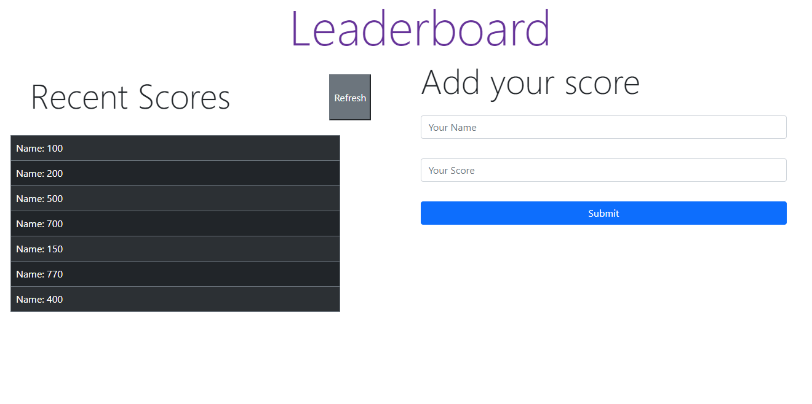

# Leaderboard

This is a Webpack Project Leaderboard and use API to add your game score and see a list of the other scores

## Built With

- HTML.
- CSS.
- Webpack.
- JavaScript.
- Linters.
- 
## Live Demo

[Live Demo Link](https://livedemo.com)

### Install

Install node.js from [HERE.](https://nodejs.org/en/)

### Deployment

1.- Clone the project using git-bash or Githup Desktop.
2.- Open the project folder with VSCode or any Editor.
3.- Open terminal and navigate to the project folder.
4.- Type npm install.
5.- Type npm start.

## Authors

👤 **Author1**

- GitHub: [@oliverSCZ](https://github.com/oliverSCZ)
- Twitter: [@olivercoimbra](https://twitter.com/olivercoimbra)
- LinkedIn: [olivercoimbra](https://linkedin.com/olivercoimbra)

## Show your support

Give a ⭐️ if you like this project!
